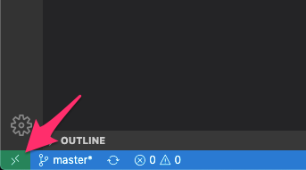

# golang-docker

## ホストの動作環境
- docker 19.03.1
- docker-compose 1.24.1
- vscode 1.42.0
- ms-vscode-remote.remote-containers 0.101.0

## コンテナ内
- go 1.13.7
- realize 2.1
- delve 1.4.0
- echo 4.1.14

## Set Up
- vscode のエクステンション `ms-vscode-remote.remote-containers` を検索してインストール。

## コンテナ起動
- 左下のアイコンからコマンドパレットを開いて、 `Remote-Containers: Reopen in Container` を選択。  



## 実行
- vscode のターミナルで...
```
$ make run
```
- http://localhost:8080

## デバッガの起動
- F5 でデバッガ起動。
  - `make run` で起動したままではポートがぶつかるので、そちらは終了しておくこと。 
