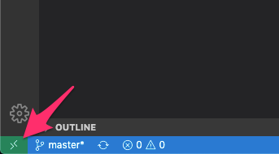
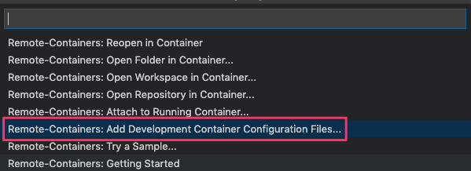
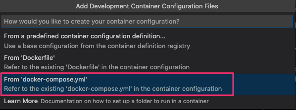
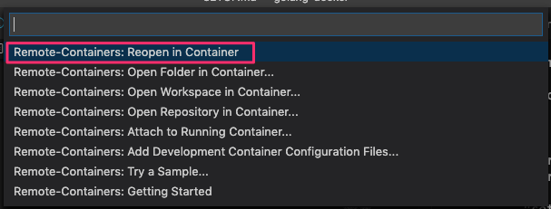
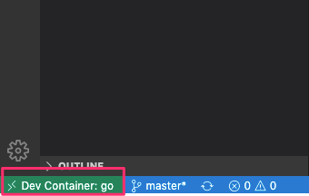
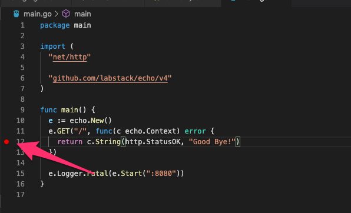
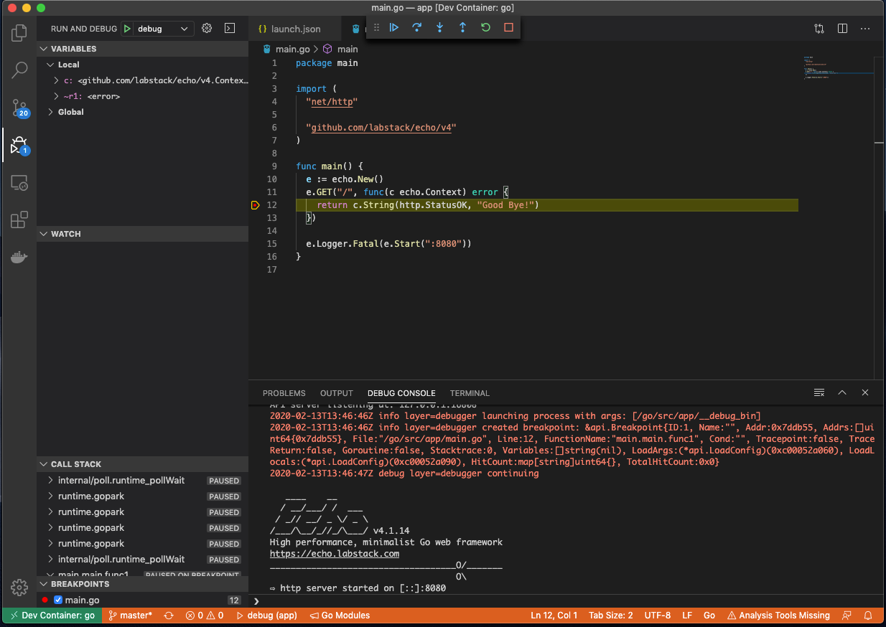

## 背景
- Go + echo で api サーバーを実装するにあたり開発環境を構築した際のメモ。
 - Docker で動かしたい。
 - VSCode の Remote Containers を試したい。
 - ホットリロード欲しい。
 - ステップ実行したい。

## ホスト
- Docker 19.03.1
- docker-compose 1.24.1
- VSCode 1.42.0
- ms-vscode-remote.remote-containers 0.101.0

## コンテナ内
- go 1.13.7
- realize 2.1
- delve 1.4.0
- echo 4.1.14

## Dockerfile + docker-compose 作成
### Dockerfile
``` :Dockerfile
FROM golang:1.13.7
 
WORKDIR /go/src/app

ENV GOPATH /go
 
RUN apt-get update \
    && apt-get install -y git \
    && go get -v \
        gopkg.in/urfave/cli.v2@master \
        github.com/oxequa/realize \
        github.com/go-delve/delve/cmd/dlv@latest \
        github.com/rogpeppe/godef@latest \
        golang.org/x/tools/gopls@latest \
        golang.org/x/tools/cmd/goimports@latest \
        github.com/ramya-rao-a/go-outline@latest  \
    && apt-get autoremove -y \
    && apt-get clean -y \
    && rm -rf /var/lib/apt/lists/*
```
- ホットリロード用に realize 、デバッグ用に delve をインストール。
- その他には VSCode 拡張の ms-vscode.go で後にレコメンドされるツール類をイントール。

### docker-compose.yml
``` :docker-compose.yml
version: '3.7'

services:
  app:
    build: .
    command: /bin/sh -c "while sleep 1000; do :; done"
    ports:
      - 8080:8080
    volumes:
      - .:/go/src/app:cached
```
- `command: /bin/sh -c "while sleep 1000; do :; done"` で Remote Container が立ち上がるまで待機しておく。

## Remote Containers
### エクステンションをインストールして起動準備
- `ms-vscode-remote.remote-containers` を検索してインストール。
- VSCode 左下に以下のアイコンが表示されるのでクリック。


- コマンドパレットが開くので `Remote-Containers: Add Development Container Configuration Files...` を選択。


- `From 'docker-compose.yml'` を選択。


- .devcontainer ディレクトリに設定ファイルが作成される。

```
.devcontainer
├── devcontainer.json
└── docker-compose.yml
```

- `.devcontainer/docker-compose.yml` は使わず、事前に作っておいた docker-compose.yml を使うので削除しておく。
- `.devcontainer/devcontainer.json` の変更。

``` :.devcontainer/devcontainer.json
{
	"name": "go",

	"dockerComposeFile": [
		"../docker-compose.yml"
	],

	"service": "app",
	"workspaceFolder": "/go/src/app",

	"settings": { 
		"terminal.integrated.shell.linux": "/bin/bash",
		"go.gopath": "/go"
	},

	"extensions": [
		"ms-vscode.go",
	],

	"shutdownAction": "stopCompose"
}
```

### Remote Container 起動
- 左下のアイコンからコマンドパレットを開いて、 `Remote-Containers: Reopen in Container` を選択。


- コンテナがビルドされて Remote Container 内に入った状態になる。


- vscode のターミナルを開くとコンテナ内のワーキングディレクトリ `/go/src/app` が開く。
- 以降はこの Remote Container 内で作業していく。

## go modules の利用準備
```
$ go mod init
```

## Makefile 作っておく
- 開発中に色々 make コマンド足していくので、とりあえず作っておく。

``` :Makefile
.PHONY: run
run:
	realize start --run
```

## realize でのホットリロード設定
- `$ make run` を実行すると .realize.yml が作成されるのでこれを以下のように修正。

``` :.realize.yml
settings:
  legacy:
    force: false
    interval: 0s
schema:
  - name: app
    path: .
    commands:
      build:
        status: true
        method: go build -o bin/main
      run:
        status: true
        method: bin/main
    watcher:
      extensions:
        - go
      paths:
        - /
      ignored_paths:
        - .git
        - .realize
        - vendor
```

## 動作確認用プログラム
- echo で Hello, World! を返すだけのやつ。

``` :main.go
package main

import (
	"net/http"

	"github.com/labstack/echo/v4"
)

func main() {
	e := echo.New()
	e.GET("/", func(c echo.Context) error {
		return c.String(http.StatusOK, "Hello, World!")
	})

	e.Logger.Fatal(e.Start(":8080"))
}
```

## 起動
```
$ make run
realize start --run
[13:38:28][APP] : Watching 1 file/s 18 folder/s
[13:38:28][APP] : Build started
[13:38:28][APP] : Build completed in 0.206 s
[13:38:28][APP] : Running..
[13:38:28][APP] :    ____    __
[13:38:28][APP] :   / __/___/ /  ___
[13:38:28][APP] :  / _// __/ _ \/ _ \
[13:38:28][APP] : /___/\__/_//_/\___/ v4.1.14
[13:38:28][APP] : High performance, minimalist Go web framework
[13:38:28][APP] : https://echo.labstack.com
[13:38:28][APP] : ____________________________________O/_______
[13:38:28][APP] :                                     O\
[13:38:28][APP] : ⇨ http server started on [::]:8080
```

- 別ターミナルで...

```
$ curl localhost:8080
Hello, World!
```

- ホットリロードが効いているのを確認するため以下の変更をして保存。

``` :main.go
e.GET("/", func(c echo.Context) error {
-    return c.String(http.StatusOK, "Hello, World!")
+    return c.String(http.StatusOK, "Good Bye!")
})
```

- 確認

```
$ curl localhost:8080
Good Bye!
```

- `ctrl + c` で終了。

## デバッガを起動してステップ実行
- デバッグ構成ファイルを作成。

``` :.vscode/launch.json
{
  "version": "0.2.0",
  "configurations": [
    {
      "name": "debug",
      "type": "go",
      "request": "launch",
      "mode": "debug",
      "program": "${workspaceFolder}",
      "showLog": true
    }
  ]
}
```

- ブレイクポイントを貼る。


- F5 でデバッガ起動。
  - `make run` で起動したままではポートがぶつかるので、そちらは終了しておくこと。 
- ブレイクポイントで止まる。

```
$ curl localhost:8080
```

